# Diagramas del Sistema de Seguimiento de OC

## 1. Diagrama de Arquitectura del Sistema

```mermaid
graph TB
    subgraph "Cliente/Usuarios"
        BROWSER[🌐 Navegador Web]
        AGENCY[📧 Agencias - Email]
        KONFIRM[📨 Kontrol Travel - Confirmaciones]
    end

    subgraph "Sistema de Seguimiento OC"
        subgraph "Frontend"
            DASHBOARD[📊 Dashboard Web<br/>FastAPI + HTML]
            API[🔌 REST API<br/>FastAPI]
        end

        subgraph "Servicios Backend"
            MONITOR[👁️ Email Monitor<br/>IMAP Watcher]
            SCHEDULER[⏰ Scheduler<br/>APScheduler]
            SENDER[📮 Email Sender<br/>SMTP Client]
            PROCESSOR[📄 PDF Processor<br/>pdfplumber]
        end

        subgraph "Almacenamiento"
            DB[(💾 SQLite DB<br/>oc_seguimiento.db)]
            FILES[📁 Archivos<br/>PDFs/Logs]
        end
    end

    subgraph "Servicios Externos"
        IMAP_IN[📬 IMAP Server<br/>Gmail - Confirmaciones]
        IMAP_OC[📬 IMAP Server<br/>Gmail - OC]
        SMTP[📤 SMTP Server<br/>Gmail - Envíos]
    end

    %% Conexiones
    BROWSER --> DASHBOARD
    BROWSER --> API
    DASHBOARD --> DB
    API --> DB

    KONFIRM --> IMAP_IN
    AGENCY --> IMAP_OC

    MONITOR --> IMAP_IN
    MONITOR --> IMAP_OC
    MONITOR --> PROCESSOR
    MONITOR --> DB

    PROCESSOR --> FILES
    PROCESSOR --> DB

    SCHEDULER --> DB
    SCHEDULER --> SENDER

    SENDER --> SMTP
    SENDER --> DB

    SMTP --> AGENCY

    style DASHBOARD fill:#3498db,color:#fff
    style API fill:#3498db,color:#fff
    style MONITOR fill:#2ecc71,color:#fff
    style SCHEDULER fill:#2ecc71,color:#fff
    style SENDER fill:#2ecc71,color:#fff
    style PROCESSOR fill:#2ecc71,color:#fff
    style DB fill:#e74c3c,color:#fff
```



## 2. Diagrama de Flujo del Proceso de OC

```mermaid
flowchart TD
    START([🚀 Inicio del Sistema]) --> INIT[Inicializar Componentes]
    INIT --> PARALLEL{Procesos Paralelos}

    PARALLEL --> MON[Monitor de Correos]
    PARALLEL --> SCHED[Scheduler de Seguimiento]
    PARALLEL --> WEB[Servidor Web]

    %% Flujo de Monitor de Correos
    MON --> CHECK_CONF[Verificar Correos<br/>de Confirmación]
    CHECK_CONF --> NEW_CONF{¿Nuevo PDF?}
    NEW_CONF -->|Sí| EXTRACT[Extraer Datos del PDF]
    NEW_CONF -->|No| CHECK_OC

    EXTRACT --> VALIDATE{¿Agencia<br/>requiere OC?}
    VALIDATE -->|Sí| CREATE_PEND[Crear Reserva<br/>Estado: PENDIENTE]
    VALIDATE -->|No| CREATE_NO[Crear Reserva<br/>Estado: NO_REQUIERE_OC]

    CREATE_PEND --> SEND_INIT[Enviar Solicitud Inicial<br/>Día 0]
    CREATE_NO --> CHECK_OC
    SEND_INIT --> MARK_SENT[Marcar como SOLICITADA]
    MARK_SENT --> CHECK_OC

    %% Flujo de Verificación de OC
    CHECK_OC[Verificar Correos<br/>de OC Recibidas]
    CHECK_OC --> NEW_OC{¿Nueva OC?}
    NEW_OC -->|Sí| MATCH[Asociar OC con Reserva]
    NEW_OC -->|No| WAIT1[Esperar 60s]

    MATCH --> FOUND{¿Reserva<br/>encontrada?}
    FOUND -->|Sí| UPDATE_REC[Actualizar Estado:<br/>RECIBIDA]
    FOUND -->|No| LOG_WARN[Log: OC sin reserva]

    UPDATE_REC --> STOP_FLOW[Detener Seguimiento]
    LOG_WARN --> WAIT1
    STOP_FLOW --> WAIT1
    WAIT1 --> CHECK_CONF

    %% Flujo de Scheduler
    SCHED --> WAIT_SCHED[Esperar Intervalo<br/>6 horas]
    WAIT_SCHED --> FIND_PEND[Buscar Reservas<br/>PENDIENTE/SOLICITADA]
    FIND_PEND --> CHECK_DAYS{Revisar Días<br/>Transcurridos}

    CHECK_DAYS -->|Día 2| SEND_REM1[Enviar Recordatorio 1]
    CHECK_DAYS -->|Día 4| SEND_REM2[Enviar Ultimátum]
    CHECK_DAYS -->|Otro| WAIT_SCHED

    SEND_REM1 --> LOG_EMAIL1[Registrar Envío]
    SEND_REM2 --> LOG_EMAIL2[Registrar Envío]
    LOG_EMAIL1 --> WAIT_SCHED
    LOG_EMAIL2 --> WAIT_SCHED

    %% Flujo de Web
    WEB --> LISTEN[Escuchar Puerto 8001]
    LISTEN --> REQ{Request}
    REQ -->|Dashboard| RENDER[Renderizar Dashboard]
    REQ -->|API| PROCESS[Procesar API]

    RENDER --> QUERY_DB[Consultar DB]
    PROCESS --> QUERY_DB
    QUERY_DB --> RESPONSE[Enviar Respuesta]
    RESPONSE --> LISTEN

    style START fill:#2ecc71,color:#fff
    style CREATE_PEND fill:#e74c3c,color:#fff
    style UPDATE_REC fill:#2ecc71,color:#fff
    style SEND_INIT fill:#3498db,color:#fff
    style SEND_REM1 fill:#f39c12,color:#fff
    style SEND_REM2 fill:#e67e22,color:#fff
```



## 3. Diagrama de Secuencia - Flujo Completo de OC

```mermaid
sequenceDiagram
    participant KT as Kontrol Travel
    participant IMAP as IMAP Monitor
    participant PDF as PDF Processor
    participant DB as Database
    participant SCHED as Scheduler
    participant SMTP as Email Sender
    participant AG as Agencia

    Note over KT,AG: 📩 Fase 1: Recepción de Confirmación
    KT->>IMAP: Enviar PDF de confirmación
    IMAP->>IMAP: Detectar nuevo correo (60s)
    IMAP->>PDF: Procesar PDF adjunto
    PDF->>PDF: Extraer: LOC, Agencia, Hotel, etc
    PDF->>DB: Validar si agencia requiere OC

    alt Requiere OC
        DB->>DB: Crear Reserva (PENDIENTE)
        DB->>SMTP: Trigger: Enviar solicitud inicial
        SMTP->>AG: 📧 Correo Día 0: Solicitud de OC
        SMTP->>DB: Registrar envío
        DB->>DB: Actualizar estado (SOLICITADA)
    else No requiere OC
        DB->>DB: Crear Reserva (NO_REQUIERE_OC)
    end

    Note over KT,AG: ⏰ Fase 2: Seguimiento Programado

    loop Cada 6 horas
        SCHED->>DB: Buscar reservas SOLICITADA
        DB->>SCHED: Lista de reservas pendientes

        alt Día 2 transcurrido
            SCHED->>SMTP: Enviar recordatorio 1
            SMTP->>AG: 📧 Correo Día 2: Recordatorio amable
            SMTP->>DB: Registrar envío
        end

        alt Día 4 transcurrido
            SCHED->>SMTP: Enviar ultimátum
            SMTP->>AG: 📧 Correo Día 4: Ultimátum
            SMTP->>DB: Registrar envío
        end
    end

    Note over KT,AG: ✅ Fase 3: Recepción de OC

    AG->>IMAP: Enviar OC por correo
    IMAP->>IMAP: Detectar correo con "Reserva XXX" o "OC XXX"
    IMAP->>DB: Buscar reserva por código

    alt Reserva encontrada
        DB->>DB: Crear registro OC
        DB->>DB: Actualizar estado (RECIBIDA)
        IMAP->>SMTP: Notificar recepción (opcional)
        Note over SCHED: ⛔ Scheduler omite esta reserva
    else Reserva no encontrada
        IMAP->>DB: Log: OC sin reserva asociada
    end

    Note over KT,AG: 📊 Fase 4: Consulta (Cualquier momento)

    participant DASH as Dashboard
    DASH->>DB: GET /api/reservas?estado=pendiente
    DB->>DASH: Lista de reservas pendientes
    DASH->>DB: GET /api/stats
    DB->>DASH: Estadísticas del sistema
```



## 4. Diagrama de Estados de una Reserva


## 5. Diagrama de Componentes - Detalle Técnico


## 6. Diagrama de Patrones de Detección de OC

```mermaid
graph TD
    EMAIL[📧 Correo Recibido] --> SUBJECT[Extraer Asunto]
    SUBJECT --> PATTERNS{Buscar Patrones}

    PATTERNS --> P1[Patrón 1:<br/>'Reserva CODIGO']
    PATTERNS --> P2[Patrón 2:<br/>'LOC CODIGO']
    PATTERNS --> P3[Patrón 3:<br/>'Orden de Compra CODIGO']
    PATTERNS --> P4[Patrón 4:<br/>'OC CODIGO']

    P1 --> REGEX1[regex: Reserva\s+[A-Z0-9]+]
    P2 --> REGEX2[regex: LOC\s+[A-Z0-9]+]
    P3 --> REGEX3[regex: orden de compra\s+[A-Z0-9]+]
    P4 --> REGEX4[regex: OC\s+[A-Z0-9]+]

    REGEX1 --> EXTRACT[Extraer CODIGO]
    REGEX2 --> EXTRACT
    REGEX3 --> EXTRACT
    REGEX4 --> EXTRACT

    EXTRACT --> SEARCH[Buscar en DB:<br/>id_reserva = CODIGO<br/>OR loc_interno = CODIGO]

    SEARCH --> FOUND{¿Encontrada?}
    FOUND -->|Sí| MATCH[✅ Asociar OC]
    FOUND -->|No| NOMATCH[❌ Log Warning]

    MATCH --> UPDATE[Actualizar Estado:<br/>RECIBIDA]
    NOMATCH --> END[Fin]
    UPDATE --> END

    style EMAIL fill:#3498db,color:#fff
    style EXTRACT fill:#2ecc71,color:#fff
    style MATCH fill:#27ae60,color:#fff
    style NOMATCH fill:#e74c3c,color:#fff
    style UPDATE fill:#2ecc71,color:#fff

    %% Ejemplos
    P1 -.->|Ej: "Reserva AAFVDUA"| REGEX1
    P2 -.->|Ej: "LOC TEST2024002"| REGEX2
    P3 -.->|Ej: "orden de compra AAFWHWS"| REGEX3
    P4 -.->|Ej: "OC AAFWHWS"| REGEX4
```

## 7. Diagrama de Base de Datos (ER)


---

## Notas de Implementación

### Tecnologías Utilizadas
- **Backend**: Python 3.10+ con FastAPI
- **ORM**: SQLAlchemy
- **Base de Datos**: SQLite (migrable a PostgreSQL)
- **Email**: imaplib, smtplib
- **PDF**: pdfplumber
- **Scheduler**: APScheduler
- **Frontend**: HTML + Jinja2 templates

### Intervalos de Monitoreo
- **Monitor de Confirmaciones**: 60 segundos (IMAP_CHECK_INTERVAL)
- **Monitor de OC**: 60 segundos (OC_CHECK_INTERVAL)
- **Scheduler de Seguimiento**: 4 veces al día (SCHEDULER_CHECKS_PER_DAY)

### Patrones de Detección (Case-Insensitive)
1. `Reserva\s+([A-Z0-9]+)` - Detecta "Reserva AAFVDUA"
2. `LOC[:\s]+([A-Z0-9]+)` - Detecta "LOC: TEST2024002"
3. `(?:orden\s+de\s+compra|OC)[:\s]+([A-Z0-9]+)` - Detecta "orden de compra AAFWHWS" o "OC AAFWHWS"

### Estados de Reserva (EstadoOC Enum)
- `NO_REQUIERE_OC` - Agencia no requiere seguimiento
- `PENDIENTE` - Reserva creada, pendiente de solicitud inicial
- `SOLICITADA` - Solicitud enviada, esperando respuesta
- `RECIBIDA` - OC recibida y asociada
- `CANCELADA` - Reserva cancelada manualmente
- `EXPIRADA` - Check-in pasó sin recibir OC

---

**Versión**: 1.1.1
**Última actualización**: 2025-11-20
