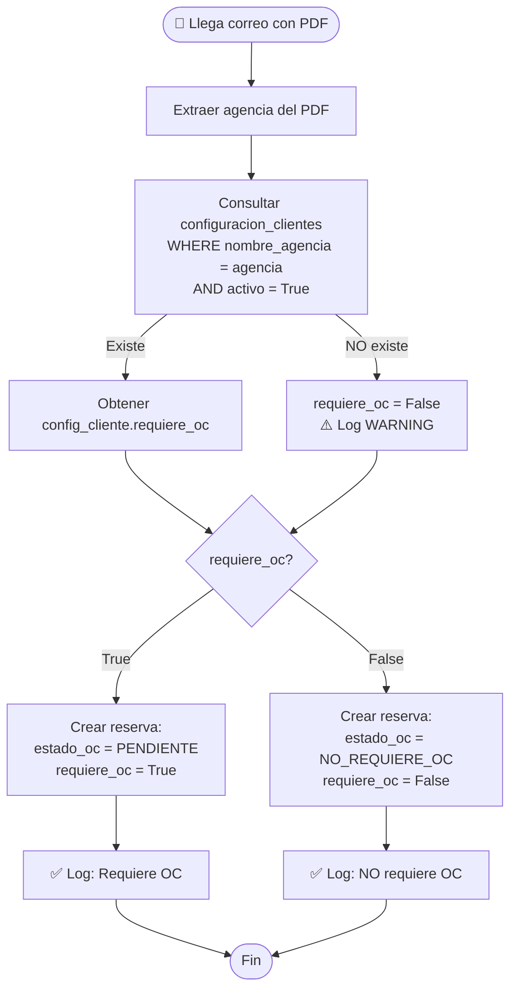

# Cambio: Validación de OC desde Base de Datos

**Fecha**: 10 de Diciembre de 2024
**Versión**: 1.3.6

## Resumen del Cambio

El sistema ahora consulta la tabla `configuracion_clientes` para determinar si una reserva requiere seguimiento de OC, en lugar de tener hardcoded `requiere_oc = True` para todas las reservas.

## Problema Anterior

### Lógica Hardcoded

**Antes** (`src/email_monitor.py` líneas 247-248):
```python
# requiere_oc = settings.requires_oc(agencia)  # Comentado
requiere_oc = True  # TODAS las reservas requieren OC
```

**Problema**:
- TODAS las reservas se creaban con `requiere_oc = True`
- No respetaba la configuración por cliente
- La tabla `configuracion_clientes` tenía 40 clientes con OC y 39 sin OC, pero esto NO se usaba

### Variable de Entorno Obsoleta

El archivo `.env` tenía:
```bash
AGENCIES_REQUIRING_OC="WALVIS S.A.,EMPRESA CORPORATIVA LTDA,AGENCIA VIAJES XYZ"
```

**Problema**: Este campo estaba comentado en el código y ya NO se usaba.

## Solución Implementada

### 1. Modificar `src/email_monitor.py`

**Cambio en líneas 245-266**:

```python
# Verificar si la agencia requiere seguimiento de OC
agencia = pdf_data.get('agencia', '')

# Consultar configuración del cliente en la BD
config_cliente = db.query(ConfiguracionCliente).filter_by(
    nombre_agencia=agencia,
    activo=True
).first()

if config_cliente:
    requiere_oc = config_cliente.requiere_oc
    self.logger.info(
        f"🔍 Cliente {agencia}: requiere_oc={requiere_oc} "
        f"(según configuración en BD)"
    )
else:
    # Cliente no existe en BD: NO requiere OC por defecto
    requiere_oc = False
    self.logger.warning(
        f"⚠️ Cliente {agencia} no encontrado en configuracion_clientes. "
        f"Se asume requiere_oc=False"
    )
```

**Importación agregada** (línea 20):
```python
from database import Reserva, OrdenCompra, EstadoOC, ConfiguracionCliente, get_db
```

### 2. Actualizar `.env.example`

**Cambio en líneas 83-92**:
```bash
# ============================================================================
# CLIENTES QUE REQUIEREN OC (DEPRECATED - Ya NO se usa)
# ============================================================================
# NOTA: Este campo ya NO se utiliza. La configuración de clientes ahora se
# gestiona desde la base de datos en la tabla 'configuracion_clientes'.
# Para configurar clientes, usar:
#   - Dashboard web: http://localhost:8001/clientes
#   - Script: python scripts/utils/configurar_cliente.py
#   - Excel: python scripts/database/cargar_clientes_excel.py
AGENCIES_REQUIRING_OC=""
```

## Lógica Nueva

### Flujo de Validación



### Casos de Uso

#### Caso 1: Cliente Configurado con OC

```
📧 Llega reserva de "WALVIS S.A."
🔍 Consulta BD: configuracion_clientes.requiere_oc = True
✅ Reserva creada: estado_oc = PENDIENTE, requiere_oc = True
📧 Se enviarán correos de seguimiento
```

#### Caso 2: Cliente Configurado sin OC

```
📧 Llega reserva de "FUNDACION COANIL"
🔍 Consulta BD: configuracion_clientes.requiere_oc = False
✅ Reserva creada: estado_oc = NO_REQUIERE_OC, requiere_oc = False
🚫 NO se enviarán correos de seguimiento
```

#### Caso 3: Cliente NO Configurado

```
📧 Llega reserva de "NUEVA EMPRESA S.A."
🔍 Consulta BD: Cliente no encontrado
⚠️ WARNING: Cliente no encontrado, se asume requiere_oc = False
✅ Reserva creada: estado_oc = NO_REQUIERE_OC, requiere_oc = False
🚫 NO se enviarán correos de seguimiento
```

## Configuración de Clientes

### Métodos para Configurar Clientes

#### 1. Dashboard Web (Recomendado)

```bash
# Acceder al dashboard
open http://localhost:8001/clientes
```

Opciones:
- Ver todos los clientes
- Filtrar por requiere/no requiere OC
- Editar configuración individual
- Agregar nuevo cliente

#### 2. Script Interactivo

```bash
PYTHONPATH=. python scripts/utils/configurar_cliente.py
```

Permite:
- Agregar nuevo cliente
- Actualizar cliente existente
- Configurar email de contacto
- Establecer si requiere OC

#### 3. Cargar desde Excel

```bash
PYTHONPATH=. python scripts/database/cargar_clientes_excel.py
```

Carga masivamente desde `data/clientes.xlsx`.

#### 4. SQL Directo

```sql
-- Ver clientes actuales
SELECT nombre_agencia, requiere_oc, email_contacto, activo
FROM configuracion_clientes
ORDER BY nombre_agencia;

-- Agregar nuevo cliente
INSERT INTO configuracion_clientes
(nombre_agencia, requiere_oc, activo, email_contacto)
VALUES ('NUEVA EMPRESA S.A.', 1, 1, 'contacto@nuevaempresa.com');

-- Actualizar cliente existente
UPDATE configuracion_clientes
SET requiere_oc = 1, email_contacto = 'nuevo@email.com'
WHERE nombre_agencia = 'WALVIS S.A.';
```

## Comportamiento por Defecto

### Cliente NO Existe en BD

**Decisión de diseño**: Si un cliente NO está en `configuracion_clientes`, se asume `requiere_oc = False`.

**Razón**:
- ✅ Más seguro: No enviar correos innecesarios
- ✅ Evita spam a clientes que no requieren OC
- ⚠️ Importante: Configurar TODOS los clientes que SÍ requieren OC

**Alternativa**: Si prefieres que por defecto requieran OC, cambiar línea 262 en `email_monitor.py`:
```python
requiere_oc = True  # Cambiar a True para requerir OC por defecto
```

## Logs del Sistema

### Logs de Validación

Con el nuevo sistema, los logs mostrarán:

**Cliente encontrado con OC**:
```
🔍 Cliente WALVIS S.A.: requiere_oc=True (según configuración en BD)
✅ Reserva creada: 45215412 - WALVIS S.A. - Requiere OC: Sí
```

**Cliente encontrado sin OC**:
```
🔍 Cliente FUNDACION COANIL: requiere_oc=False (según configuración en BD)
✅ Reserva creada: 123456 - FUNDACION COANIL - Requiere OC: No
```

**Cliente NO configurado**:
```
⚠️ Cliente NUEVA EMPRESA S.A. no encontrado en configuracion_clientes. Se asume requiere_oc=False
✅ Reserva creada: 789012 - NUEVA EMPRESA S.A. - Requiere OC: No
```

### Monitorear Logs

```bash
# Ver logs en tiempo real
tail -f logs/oc_seguimiento_*.log | grep "🔍\|⚠️.*no encontrado"

# Ver clientes no configurados en últimas 24h
grep "no encontrado en configuracion_clientes" logs/oc_seguimiento_*.log | tail -20
```

## Impacto y Migración

### Reservas Existentes

Las reservas ya creadas con `requiere_oc = True` **NO se modifican automáticamente**.

Para corregir reservas existentes:

```sql
-- Ver reservas que no deberían requerir OC
SELECT r.id_reserva, r.agencia, r.requiere_oc, c.requiere_oc as config_requiere_oc
FROM reservas r
LEFT JOIN configuracion_clientes c ON r.agencia = c.nombre_agencia
WHERE r.requiere_oc != c.requiere_oc;

-- Corregir estado de reservas según configuración actual
UPDATE reservas
SET
    requiere_oc = (
        SELECT COALESCE(c.requiere_oc, 0)
        FROM configuracion_clientes c
        WHERE c.nombre_agencia = reservas.agencia
    ),
    estado_oc = CASE
        WHEN (SELECT COALESCE(c.requiere_oc, 0) FROM configuracion_clientes c WHERE c.nombre_agencia = reservas.agencia) = 0
        THEN 'NO_REQUIERE_OC'
        ELSE estado_oc
    END
WHERE estado_oc = 'PENDIENTE';
```

### Nuevas Reservas

Todas las reservas nuevas respetarán la configuración de `configuracion_clientes`.

## Estadísticas Actuales

```bash
# Ver estadísticas de configuración
sqlite3 data/oc_seguimiento.db "
SELECT
    COUNT(*) as total_clientes,
    SUM(CASE WHEN requiere_oc = 1 THEN 1 ELSE 0 END) as con_oc,
    SUM(CASE WHEN requiere_oc = 0 THEN 1 ELSE 0 END) as sin_oc,
    SUM(CASE WHEN activo = 1 THEN 1 ELSE 0 END) as activos,
    SUM(CASE WHEN activo = 0 THEN 1 ELSE 0 END) as inactivos
FROM configuracion_clientes;
"
```

Resultado actual:
- **Total**: 79 clientes
- **Con OC**: 40 clientes
- **Sin OC**: 39 clientes

## Testing

### Probar con Cliente que Requiere OC

```bash
# 1. Verificar que cliente está configurado
sqlite3 data/oc_seguimiento.db "
SELECT nombre_agencia, requiere_oc, email_contacto
FROM configuracion_clientes
WHERE nombre_agencia = 'WALVIS S.A.';
"

# 2. Enviar correo de prueba con PDF de WALVIS S.A.
PYTHONPATH=. python scripts/utils/enviar_prueba.py

# 3. Ver logs
tail -f logs/oc_seguimiento_*.log | grep "WALVIS"

# Debería mostrar:
# 🔍 Cliente WALVIS S.A.: requiere_oc=True (según configuración en BD)
```

### Probar con Cliente que NO Requiere OC

```bash
# 1. Verificar configuración
sqlite3 data/oc_seguimiento.db "
SELECT nombre_agencia, requiere_oc
FROM configuracion_clientes
WHERE nombre_agencia = 'FUNDACION COANIL';
"

# 2. Cambiar agencia en PDF de prueba temporalmente
# 3. Enviar correo
# 4. Verificar que NO se envían correos de seguimiento
```

### Probar con Cliente NO Configurado

```bash
# 1. Enviar PDF con agencia no configurada
# 2. Ver logs:
tail -f logs/oc_seguimiento_*.log | grep "no encontrado"

# Debería mostrar:
# ⚠️ Cliente NUEVA EMPRESA S.A. no encontrado en configuracion_clientes
```

## Ventajas del Nuevo Sistema

1. ✅ **Flexibilidad**: Configuración por cliente desde la BD
2. ✅ **Escalabilidad**: Agregar/modificar clientes sin reiniciar el sistema
3. ✅ **Dashboard**: Interfaz web para gestionar clientes
4. ✅ **Auditoría**: Logs claros de qué clientes requieren/no requieren OC
5. ✅ **Precisión**: Respeta la configuración individual de cada cliente
6. ✅ **Eficiencia**: No envía correos innecesarios a clientes sin OC

## Archivos Modificados

```
✏️  src/email_monitor.py           (líneas 20, 245-266)
✏️  .env.example                    (líneas 83-92)
📄  docs/CHANGELOG_VALIDACION_OC.md (NUEVO - este archivo)
```

## Próximas Mejoras

1. **Auto-crear clientes**: Agregar automáticamente clientes nuevos a la BD con `requiere_oc = False`
2. **Notificación**: Email a admin cuando se detecta cliente no configurado
3. **API endpoint**: Agregar/actualizar clientes vía API REST
4. **Importación masiva**: Mejorar script para importar desde CSV/Excel

---

**Versión del documento**: 1.0
**Relacionado con**: v1.3.4 (Fecha de emisión), v1.3.5 (Expiración)
