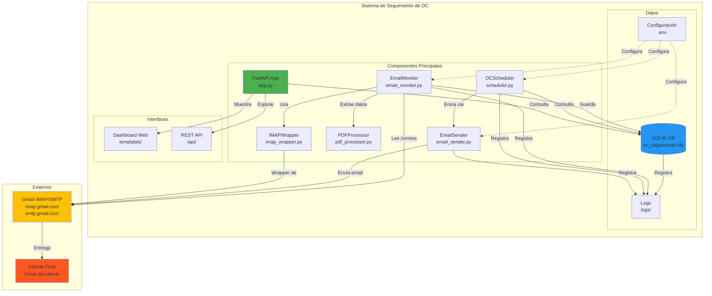
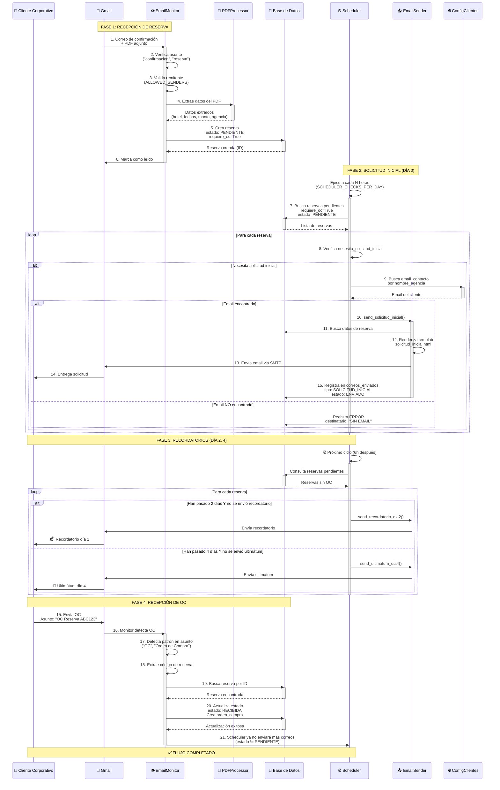
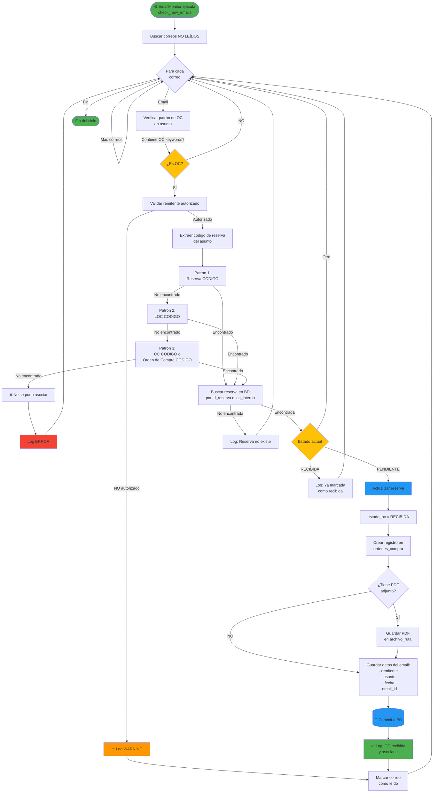
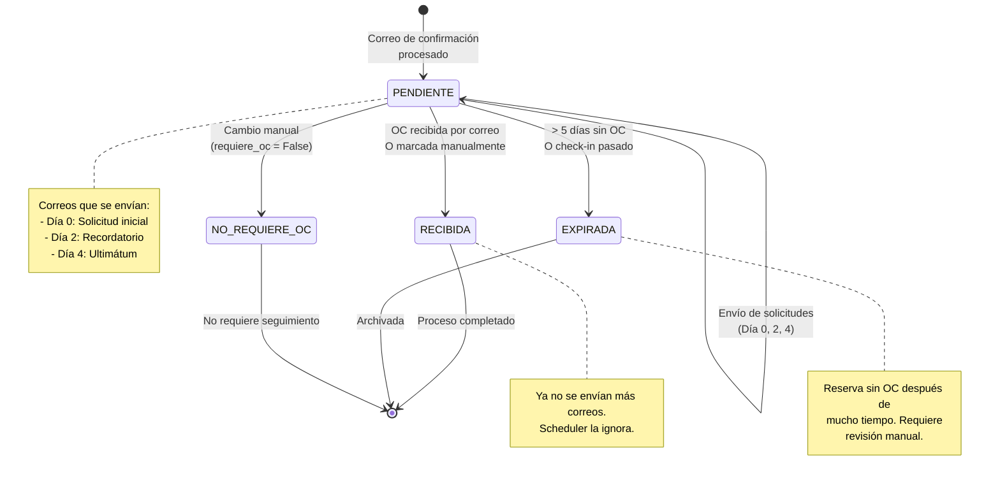

# 🔄 Flujo Detallado del Sistema - Seguimiento de OC

**Versión**: 1.3.3
**Fecha**: 9 de Diciembre de 2024

Este documento contiene diagramas detallados de todos los flujos y componentes del sistema.

---

## 📋 Índice

1. [Arquitectura General](#arquitectura-general)
2. [Flujo Completo End-to-End](#flujo-completo-end-to-end)
3. [Flujo de Procesamiento de Correos de Confirmación](#flujo-de-procesamiento-de-correos-de-confirmación)
4. [Flujo del Scheduler y Envío de Solicitudes](#flujo-del-scheduler-y-envío-de-solicitudes)
5. [Flujo de Detección de OC Recibida](#flujo-de-detección-de-oc-recibida)
6. [Diagrama de Estados de Reserva](#diagrama-de-estados-de-reserva)
7. [Configuraciones del Sistema](#configuraciones-del-sistema)
8. [Matriz de Decisiones](#matriz-de-decisiones)

---

## 1. Arquitectura General



---

## 2. Flujo Completo End-to-End



---

## 3. Flujo de Procesamiento de Correos de Confirmación

```
┌─────────────────────────────────────────────────────────────────────────┐
│                     PROCESAMIENTO DE CORREO DE CONFIRMACIÓN             │
└─────────────────────────────────────────────────────────────────────────┘

📥 CORREO ENTRANTE
   │
   ├─► 1. EmailMonitor.check_new_emails()
   │      Frecuencia: IMAP_CHECK_INTERVAL (default: 300s = 5 min)
   │      Carpeta: IMAP_MAILBOX (default: "INBOX")
   │
   ├─► 2. Filtrar solo correos NO LEÍDOS
   │      SQL: UNSEEN
   │
   └─► 3. Para cada correo:

       ┌─────────────────────────────────────────────┐
       │  VALIDACIÓN DE ASUNTO                       │
       ├─────────────────────────────────────────────┤
       │  Keywords:                                  │
       │  ✓ "confirmacion"                           │
       │  ✓ "confirmación"                           │
       │  ✓ "reserva"                                │
       │  ✓ "booking"                                │
       │  ✓ "confirmation"                           │
       └─────────────────────────────────────────────┘
              │ ¿Coincide?
              ├─ NO ──► Ignorar correo
              └─ SÍ ──► Continuar

       ┌─────────────────────────────────────────────┐
       │  VALIDACIÓN DE REMITENTE                    │
       ├─────────────────────────────────────────────┤
       │  Configuración: ALLOWED_SENDERS             │
       │  Lista en .env separada por comas           │
       │                                             │
       │  Ejemplo:                                   │
       │  reservas@ideasfractal.com                  │
       │  booking@agency.com                         │
       │  confirmations@hotel.com                    │
       └─────────────────────────────────────────────┘
              │ ¿Autorizado?
              ├─ NO ──► ⚠️ Log WARNING + Ignorar
              └─ SÍ ──► Continuar

       ┌─────────────────────────────────────────────┐
       │  VALIDACIÓN DE ADJUNTOS                     │
       ├─────────────────────────────────────────────┤
       │  Buscar: attachments con extension ".pdf"  │
       │  Content-Type: application/pdf              │
       └─────────────────────────────────────────────┘
              │ ¿Tiene PDF?
              ├─ NO ──► Ignorar correo
              └─ SÍ ──► Continuar (puede tener múltiples)

       ┌─────────────────────────────────────────────────────────────┐
       │  EXTRACCIÓN DE DATOS DEL PDF                                │
       ├─────────────────────────────────────────────────────────────┤
       │  PDFProcessor.extract_from_bytes()                          │
       │                                                             │
       │  Extrae (usando regex y patrones):                          │
       │  ✓ ID Reserva / LOC Interno                                │
       │  ✓ Nombre Hotel                                            │
       │  ✓ Dirección, Teléfono                                     │
       │  ✓ Fechas Check-in / Check-out                             │
       │  ✓ Horas de llegada/salida                                 │
       │  ✓ Número de noches                                        │
       │  ✓ Monto Total (13+ formatos)                              │
       │  ✓ Moneda (CLP, USD, EUR)                                  │
       │  ✓ Detalles de habitaciones                                │
       │  ✓ Nombre de Agencia ⭐                                     │
       └─────────────────────────────────────────────────────────────┘
              │ ¿Datos válidos?
              ├─ NO ──► ❌ Log ERROR + Ignorar
              └─ SÍ ──► Continuar

       ┌─────────────────────────────────────────────────────────────┐
       │  DETERMINACIÓN DE REQUISITO DE OC                           │
       ├─────────────────────────────────────────────────────────────┤
       │  Configuración actual:                                      │
       │  requiere_oc = True  (TODAS las reservas)                   │
       │                                                             │
       │  Alternativa (comentada):                                   │
       │  requiere_oc = settings.requires_oc(agencia)                │
       │  └─► Buscaría en configuracion_clientes                    │
       └─────────────────────────────────────────────────────────────┘
              │
              ├─► requiere_oc = True
              │
              └─► estado_oc = PENDIENTE

       ┌─────────────────────────────────────────────────────────────┐
       │  VERIFICACIÓN DE DUPLICADOS                                 │
       ├─────────────────────────────────────────────────────────────┤
       │  SELECT * FROM reservas                                     │
       │  WHERE id_reserva = ?                                       │
       └─────────────────────────────────────────────────────────────┘
              │ ¿Ya existe?
              ├─ SÍ ──► ⚠️ Log WARNING + Ignorar
              └─ NO ──► Continuar

       ┌─────────────────────────────────────────────────────────────┐
       │  CREACIÓN DE RESERVA EN BASE DE DATOS                       │
       ├─────────────────────────────────────────────────────────────┤
       │  INSERT INTO reservas (                                     │
       │    id_reserva, loc_interno, agencia,                        │
       │    nombre_hotel, monto_total,                               │
       │    fecha_checkin, fecha_checkout,                           │
       │    estado_oc = 'PENDIENTE',                                 │
       │    requiere_oc = True,                                      │
       │    email_origen_id = email_uid,                             │
       │    email_origen_fecha = email_date,  ⭐ DÍA 0              │
       │    fecha_creacion = NOW(),                                  │
       │    ...                                                      │
       │  )                                                          │
       └─────────────────────────────────────────────────────────────┘
              │
              ├─► ✅ Reserva creada exitosamente
              │
              ├─► 📝 Log: "Reserva creada: ID - AGENCIA"
              │
              └─► Marcar correo como LEÍDO (flag \Seen)

       ⚠️  IMPORTANTE: NO SE ENVÍA CORREO EN ESTE PUNTO
           El envío lo maneja el Scheduler posteriormente
```

---

## 4. Flujo del Scheduler y Envío de Solicitudes

```
┌─────────────────────────────────────────────────────────────────────────┐
│                      SCHEDULER - PROCESO AUTOMÁTICO                      │
└─────────────────────────────────────────────────────────────────────────┘

⏰ INICIALIZACIÓN DEL SISTEMA
   │
   ├─► app.py startup_event()
   │   └─► oc_scheduler.start()
   │
   └─► Tareas programadas:

       ┌──────────────────────────────────────────────────────────┐
       │  TAREA 1: process_pending_emails()                       │
       ├──────────────────────────────────────────────────────────┤
       │  Frecuencia: SCHEDULER_CHECKS_PER_DAY (default: 4)       │
       │  Intervalo: 24h / 4 = cada 6 horas                       │
       │  ⚡ Se ejecuta INMEDIATAMENTE al iniciar                 │
       └──────────────────────────────────────────────────────────┘

       ┌──────────────────────────────────────────────────────────┐
       │  TAREA 2: retry_failed_emails()                          │
       ├──────────────────────────────────────────────────────────┤
       │  Frecuencia: Cada 2 horas                                │
       └──────────────────────────────────────────────────────────┘

       ┌──────────────────────────────────────────────────────────┐
       │  TAREA 3: cleanup_expired_reservations()                 │
       ├──────────────────────────────────────────────────────────┤
       │  Frecuencia: Diario a las 2:00 AM                        │
       └──────────────────────────────────────────────────────────┘

       ┌──────────────────────────────────────────────────────────┐
       │  TAREA 4: daily_status_report()                          │
       ├──────────────────────────────────────────────────────────┤
       │  Frecuencia: Diario a las 8:00 AM                        │
       └──────────────────────────────────────────────────────────┘


═══════════════════════════════════════════════════════════════════════════
  TAREA 1: process_pending_emails() - DETALLE COMPLETO
═══════════════════════════════════════════════════════════════════════════

   🔍 PASO 1: CONSULTA A BASE DE DATOS
   ┌──────────────────────────────────────────────────────────────┐
   │  SELECT * FROM reservas                                      │
   │  WHERE requiere_oc = True                                    │
   │    AND estado_oc = 'PENDIENTE'                               │
   │  ORDER BY fecha_creacion ASC                                 │
   └──────────────────────────────────────────────────────────────┘
        │
        ├─► Lista de reservas pendientes
        └─► Para cada reserva:


   🔍 PASO 2: BUSCAR CONFIGURACIÓN DEL CLIENTE
   ┌──────────────────────────────────────────────────────────────┐
   │  SELECT * FROM configuracion_clientes                        │
   │  WHERE nombre_agencia = reserva.agencia                      │
   │    AND activo = True                                         │
   └──────────────────────────────────────────────────────────────┘
        │ ¿Cliente configurado?
        ├─ NO ──► ⚠️ Log WARNING + Skip reserva
        └─ SÍ ──► Continuar
             │
             ├─► email_contacto         ⭐ CRÍTICO
             ├─► dias_recordatorio_1 (default: 2)
             └─► dias_recordatorio_2 (default: 4)


   🔍 PASO 3: DETERMINAR QUÉ CORREO ENVIAR
   ┌──────────────────────────────────────────────────────────────┐
   │                    ÁRBOL DE DECISIONES                       │
   └──────────────────────────────────────────────────────────────┘

   ┌─────────────────────────────────────────────────────────────────┐
   │  A. ¿necesita_solicitud_inicial?                                │
   ├─────────────────────────────────────────────────────────────────┤
   │  Condiciones:                                                   │
   │  ✓ requiere_oc == True                                          │
   │  ✓ estado_oc == PENDIENTE                                       │
   │  ✓ NO existe registro en correos_enviados con                   │
   │    tipo_correo = SOLICITUD_INICIAL                              │
   └─────────────────────────────────────────────────────────────────┘
        │ ¿Cumple?
        └─ SÍ ──► 📧 ENVIAR SOLICITUD INICIAL (DÍA 0)

              ┌─────────────────────────────────────────────────────┐
              │  EmailSender.send_solicitud_inicial()               │
              ├─────────────────────────────────────────────────────┤
              │                                                     │
              │  1. Verificar email_contacto                        │
              │     │                                               │
              │     ├─ email_contacto exists?                       │
              │     │  └─ NO ──► ❌ ERROR                           │
              │     │            Registra en BD:                    │
              │     │            destinatario: "SIN EMAIL"          │
              │     │            estado: ERROR                      │
              │     │            return False                       │
              │     │                                               │
              │     └─ SÍ ──► Continuar                             │
              │                                                     │
              │  2. Renderizar template                             │
              │     Template: solicitud_inicial.html                │
              │     Variables:                                      │
              │       - id_reserva                                  │
              │       - agencia                                     │
              │       - nombre_hotel                                │
              │       - fecha_checkin                               │
              │       - monto_total                                 │
              │       - loc_interno                                 │
              │                                                     │
              │  3. Configurar correo                               │
              │     From: SMTP_FROM_EMAIL                           │
              │     To: email_contacto                              │
              │     CC: EMAIL_CC_RECIPIENTS                         │
              │     Subject: "Solicitud de Orden de Compra..."     │
              │                                                     │
              │  4. Enviar via SMTP                                 │
              │     Host: SMTP_HOST                                 │
              │     Port: SMTP_PORT                                 │
              │     TLS: SMTP_USE_TLS                               │
              │     Auth: SMTP_USERNAME / SMTP_PASSWORD             │
              │                                                     │
              │  5. Registrar en correos_enviados                   │
              │     tipo_correo: SOLICITUD_INICIAL                  │
              │     destinatario: email_contacto                    │
              │     estado: ENVIADO / ERROR                         │
              │     fecha_programado: NOW()                         │
              │     fecha_enviado: NOW() (si exitoso)               │
              │     intentos: 1                                     │
              │                                                     │
              │  6. Return True/False                               │
              └─────────────────────────────────────────────────────┘

   ┌─────────────────────────────────────────────────────────────────┐
   │  B. ¿necesita_recordatorio_dia2?                                │
   ├─────────────────────────────────────────────────────────────────┤
   │  Condiciones:                                                   │
   │  ✓ requiere_oc == True                                          │
   │  ✓ estado_oc == PENDIENTE                                       │
   │  ✓ dias_desde_creacion >= dias_recordatorio_1 (default: 2)      │
   │  ✓ NO existe registro en correos_enviados con                   │
   │    tipo_correo = RECORDATORIO_DIA_2                             │
   └─────────────────────────────────────────────────────────────────┘
        │ ¿Cumple?
        └─ SÍ ──► 📧 ENVIAR RECORDATORIO (DÍA 2)
              │
              └─► EmailSender.send_recordatorio_dia2()
                  Template: recordatorio_dia2.html
                  Subject: "Recordatorio: Orden de Compra..."

   ┌─────────────────────────────────────────────────────────────────┐
   │  C. ¿necesita_ultimatum_dia4?                                   │
   ├─────────────────────────────────────────────────────────────────┤
   │  Condiciones:                                                   │
   │  ✓ requiere_oc == True                                          │
   │  ✓ estado_oc == PENDIENTE                                       │
   │  ✓ dias_desde_creacion >= dias_recordatorio_2 (default: 4)      │
   │  ✓ NO existe registro en correos_enviados con                   │
   │    tipo_correo = ULTIMATUM_DIA_4                                │
   └─────────────────────────────────────────────────────────────────┘
        │ ¿Cumple?
        └─ SÍ ──► 🚨 ENVIAR ULTIMÁTUM (DÍA 4)
              │
              └─► EmailSender.send_ultimatum_dia4()
                  Template: ultimatum_dia4.html
                  Subject: "URGENTE: Suspensión de Reserva..."

   ┌─────────────────────────────────────────────────────────────────┐
   │  D. ¿Han pasado más de 5 días?                                  │
   ├─────────────────────────────────────────────────────────────────┤
   │  dias_desde_creacion > 5                                        │
   └─────────────────────────────────────────────────────────────────┘
        │ ¿Cumple?
        └─ SÍ ──► ⚠️ MARCAR COMO EXPIRADA
              │
              └─► UPDATE reservas
                  SET estado_oc = 'EXPIRADA'
                  WHERE id = reserva.id


   📊 PASO 4: ESTADÍSTICAS Y LOG
   ┌──────────────────────────────────────────────────────────────┐
   │  Log final:                                                  │
   │  "✅ Procesamiento completado: N correos enviados"           │
   └──────────────────────────────────────────────────────────────┘


═══════════════════════════════════════════════════════════════════════════
  CÁLCULO DE días_desde_creacion ⭐ IMPORTANTE (v1.3.4+)
═══════════════════════════════════════════════════════════════════════════

   @property
   def dias_desde_creacion(self) -> int:
       # Prioridad: fecha_emision (PDF) > email_origen_fecha > fecha_creacion
       fecha_referencia = self.fecha_emision or self.email_origen_fecha or self.fecha_creacion
       return (datetime.utcnow() - fecha_referencia).days

   Ejemplos con FECHA DE EMISIÓN (preferida):
   ├─► Fecha Emisión PDF: 2024-12-05 00:00  ← DÍA 0
   │   Correo llegó: 2024-12-09 10:00
   │   fecha_referencia = fecha_emision = 2024-12-05
   │
   │   Hoy: 2024-12-07 14:00
   │   dias_desde_creacion = 2 días ──► Enviar RECORDATORIO_DIA_2
   │
   │   Hoy: 2024-12-09 14:00
   │   dias_desde_creacion = 4 días ──► Enviar ULTIMATUM_DIA_4
   │
   └─► Si fecha_emision es "INMEDIATO" o NULL, usa email_origen_fecha
       Si email_origen_fecha es NULL, usa fecha_creacion

   Casos especiales:
   • PDF dice "INMEDIATO" → fecha_emision = None → usa email_origen_fecha
   • PDF sin campo fecha → fecha_emision = None → usa email_origen_fecha
   • Fecha no parseable → fecha_emision = None → usa email_origen_fecha
```

---

## 5. Flujo de Detección de OC Recibida



**Patrones de Detección de OC (Código):**

```python
# src/email_monitor.py líneas 447-482

# Patrón 1: "Reserva CODIGO" o "reserva CODIGO"
match = re.search(r'reserva\s+([A-Z0-9]{6,})', subject, re.IGNORECASE)
if match:
    codigo_reserva = match.group(1).upper()
    reserva = db.query(Reserva).filter(
        (Reserva.id_reserva == codigo_reserva) |
        (Reserva.loc_interno == codigo_reserva)
    ).first()

# Patrón 2: "LOC CODIGO" o "loc CODIGO"
if not reserva:
    match = re.search(r'LOC\s+([A-Z0-9]{6,})', subject, re.IGNORECASE)
    if match:
        codigo_loc = match.group(1).upper()
        reserva = db.query(Reserva).filter_by(loc_interno=codigo_loc).first()

# Patrón 3: "OC CODIGO" o "Orden de Compra CODIGO"
if not reserva:
    match = re.search(r'(?:OC|orden\s+de\s+compra)\s+([A-Z0-9]{6,})',
                      subject, re.IGNORECASE)
    if match:
        codigo = match.group(1).upper()
        reserva = db.query(Reserva).filter(
            (Reserva.id_reserva == codigo) |
            (Reserva.loc_interno == codigo)
        ).first()
```

---

## 6. Diagrama de Estados de Reserva



**Transiciones de Estado:**

| Estado Actual | Evento | Estado Nuevo | Acción |
|---------------|--------|--------------|--------|
| `null` | Correo confirmación procesado | `PENDIENTE` | Crear reserva |
| `PENDIENTE` | Scheduler procesa | `PENDIENTE` | Enviar correo (día 0, 2, o 4) |
| `PENDIENTE` | OC recibida por email | `RECIBIDA` | Crear orden_compra |
| `PENDIENTE` | API: marcar-oc-recibida | `RECIBIDA` | Crear orden_compra (manual) |
| `PENDIENTE` | dias_desde_creacion > 5 | `EXPIRADA` | Log warning |
| `PENDIENTE` | fecha_checkin < now | `EXPIRADA` | Cleanup automático |
| `PENDIENTE` | Cambio manual | `NO_REQUIERE_OC` | Actualizar requiere_oc=False |
| `RECIBIDA` | - | `RECIBIDA` | Estado final |
| `EXPIRADA` | - | `EXPIRADA` | Estado final |

---

## 7. Configuraciones del Sistema

### 7.1 Variables de Entorno (.env)

```bash
┌─────────────────────────────────────────────────────────────────┐
│                    CONFIGURACIONES CRÍTICAS                      │
└─────────────────────────────────────────────────────────────────┘

═══════════════════════════════════════════════════════════════════
  IMAP - RECEPCIÓN DE CORREOS
═══════════════════════════════════════════════════════════════════
IMAP_HOST=imap.gmail.com                # Servidor IMAP
IMAP_PORT=993                           # Puerto (SSL)
IMAP_USE_SSL=true                       # Usar SSL
IMAP_USERNAME=reservas@example.com      # Usuario
IMAP_PASSWORD=app_password_here         # Contraseña de aplicación
IMAP_MAILBOX=INBOX                      # Carpeta a monitorear
IMAP_CHECK_INTERVAL=300                 # Segundos entre checks (5 min)

═══════════════════════════════════════════════════════════════════
  SMTP - ENVÍO DE CORREOS
═══════════════════════════════════════════════════════════════════
SMTP_HOST=smtp.gmail.com                # Servidor SMTP
SMTP_PORT=587                           # Puerto (TLS)
SMTP_USE_TLS=true                       # Usar TLS
SMTP_USERNAME=reservas@example.com      # Usuario
SMTP_PASSWORD=app_password_here         # Contraseña de aplicación
SMTP_FROM_EMAIL=reservas@example.com    # Email remitente
SMTP_FROM_NAME=Sistema OC               # Nombre remitente

═══════════════════════════════════════════════════════════════════
  SCHEDULER - FRECUENCIA DE ENVÍOS ⭐
═══════════════════════════════════════════════════════════════════
SCHEDULER_CHECKS_PER_DAY=4              # Verificaciones por día
                                        # 4 = cada 6 horas
                                        # 24 = cada hora
                                        # 48 = cada 30 minutos

DAYS_FOR_REMINDER_1=2                   # Días para recordatorio 1
DAYS_FOR_REMINDER_2=4                   # Días para ultimátum

═══════════════════════════════════════════════════════════════════
  REMITENTES AUTORIZADOS ⭐
═══════════════════════════════════════════════════════════════════
ALLOWED_CONFIRMATION_SENDERS=reservasonline@hotelsales.cl,v.rodriguezy@gmail.com
                # Lista separada por comas
                # Solo estos emails pueden crear reservas

═══════════════════════════════════════════════════════════════════
  DESTINATARIOS EN COPIA
═══════════════════════════════════════════════════════════════════
EMAIL_CC_RECIPIENTS=administracion@tuempresa.com
                    # Todos los correos llevan copia a estos emails

═══════════════════════════════════════════════════════════════════
  BASE DE DATOS
═══════════════════════════════════════════════════════════════════
DATABASE_URL=sqlite:///./data/oc_seguimiento.db
                # Ruta a la base de datos SQLite

═══════════════════════════════════════════════════════════════════
  SERVIDOR WEB
═══════════════════════════════════════════════════════════════════
APP_HOST=0.0.0.0                        # Host (0.0.0.0 = todas las IPs)
APP_PORT=8001                           # Puerto
APP_RELOAD=false                        # Auto-reload en desarrollo
```

### 7.2 Configuración por Cliente (Base de Datos)

```
┌─────────────────────────────────────────────────────────────────┐
│           Tabla: configuracion_clientes (78 registros)          │
└─────────────────────────────────────────────────────────────────┘

Campos:
├─► nombre_agencia          STRING    PRIMARY KEY ⭐
│   Debe coincidir EXACTAMENTE con reserva.agencia
│   Ejemplo: "SAVAL", "SPARTA", "WALVIS S.A."
│
├─► email_contacto           STRING    ⭐⭐⭐ CRÍTICO
│   Email donde se envían las solicitudes de OC
│   Si es NULL o vacío → ERROR, no se envía correo
│   Ejemplo: "compras@saval.cl"
│
├─► telefono_contacto        STRING
│   Opcional, para referencia
│
├─► requiere_oc              BOOLEAN   ⭐
│   True = Cliente requiere OC formal
│   False = No requiere OC, no se hace seguimiento
│
├─► activo                   BOOLEAN
│   True = Cliente activo
│   False = Ignorar en el scheduler
│
├─► dias_recordatorio_1      INTEGER
│   Días para enviar primer recordatorio
│   Default: 2 (si NULL, usa DAYS_FOR_REMINDER_1 de .env)
│
├─► dias_recordatorio_2      INTEGER
│   Días para enviar ultimátum
│   Default: 4 (si NULL, usa DAYS_FOR_REMINDER_2 de .env)
│
└─► notas                    TEXT
    Observaciones adicionales del cliente

═══════════════════════════════════════════════════════════════════
  EJEMPLO DE REGISTROS
═══════════════════════════════════════════════════════════════════

| nombre_agencia | email_contacto        | requiere_oc | activo |
|----------------|-----------------------|-------------|--------|
| SAVAL          | compras@saval.cl      | True        | True   |
| SPARTA         | adquisiciones@sparta  | True        | True   |
| WALVIS S.A.    | victor.rodriguez@...  | True        | True   |
| FUNDACION...   | NULL                  | False       | True   |

⚠️  PENDIENTE: 77 de 78 clientes sin email_contacto configurado
    Ver: PROXIMOS_PASOS_EMAILS.md
```

---

## 8. Matriz de Decisiones

### 8.1 ¿Se procesa el correo de confirmación?

| Condición | Valor | ¿Procesar? |
|-----------|-------|------------|
| Asunto contiene "confirmacion"/"reserva" | ❌ NO | ❌ Ignorar |
| Asunto contiene "confirmacion"/"reserva" | ✅ SÍ | ✅ |
| Remitente en ALLOWED_SENDERS | ❌ NO | ❌ Ignorar + Log WARNING |
| Remitente en ALLOWED_SENDERS | ✅ SÍ | ✅ |
| Tiene adjuntos PDF | ❌ NO | ❌ Ignorar |
| Tiene adjuntos PDF | ✅ SÍ | ✅ |
| Datos del PDF válidos | ❌ NO | ❌ Ignorar + Log ERROR |
| Datos del PDF válidos | ✅ SÍ | ✅ |
| Reserva ya existe (id_reserva) | ✅ SÍ | ❌ Ignorar + Log WARNING |
| Reserva ya existe (id_reserva) | ❌ NO | ✅ Crear reserva |

### 8.2 ¿Se envía correo de solicitud?

| Condición | Resultado |
|-----------|-----------|
| `requiere_oc = False` | ❌ NO enviar nunca |
| `estado_oc != PENDIENTE` | ❌ NO enviar (ya recibida/expirada) |
| `necesita_solicitud_inicial = True` | ✅ Enviar SOLICITUD_INICIAL |
| `necesita_recordatorio_dia2 = True` | ✅ Enviar RECORDATORIO_DIA_2 |
| `necesita_ultimatum_dia4 = True` | ✅ Enviar ULTIMATUM_DIA_4 |
| `dias_desde_creacion > 5` | ⚠️ Marcar como EXPIRADA |
| `email_contacto es NULL` | ❌ ERROR, registrar en BD |

### 8.3 ¿Cuándo se marca como RECIBIDA?

| Evento | ¿Marca como RECIBIDA? | Acción adicional |
|--------|------------------------|------------------|
| OC detectada por patrón en asunto | ✅ SÍ | Crear orden_compra |
| API: POST /reservas/{id}/marcar-oc-recibida | ✅ SÍ | Crear orden_compra (manual) |
| Usuario marca en dashboard | ✅ SÍ | Llamar API |
| Han pasado 5+ días sin OC | ❌ NO | Marca como EXPIRADA |

### 8.4 Frecuencia de Ejecución del Scheduler

| SCHEDULER_CHECKS_PER_DAY | Intervalo | Uso recomendado |
|--------------------------|-----------|-----------------|
| 1 | 24 horas | ❌ Muy lento |
| 4 | 6 horas | ✅ **PRODUCCIÓN** (default) |
| 6 | 4 horas | ✅ Producción activa |
| 12 | 2 horas | ⚠️ Alto tráfico |
| 24 | 1 hora | ⚠️ Testing |
| 48 | 30 minutos | ⚠️ Development |
| 96 | 15 minutos | ⚠️ Debug |

---

## 9. Casos de Uso Completos

### Caso 1: Flujo Normal Exitoso

```
🎬 ESCENARIO: Cliente SAVAL - Flujo completo

DÍA 0 - Lunes 09:00
────────────────────────────────────────────────────────────────
✉️  Llega correo: "Confirmación de Reserva Hotel Marriott"
    From: reservas@ideasfractal.com
    Adjunto: confirmacion_ABC123.pdf

📥 EmailMonitor procesa:
    ✅ Asunto válido
    ✅ Remitente autorizado
    ✅ PDF extraído: Agencia = "SAVAL", Monto = $450.000
    ✅ Reserva creada (ID: ABC123, estado: PENDIENTE)

⏰ Scheduler ejecuta (15:00 - 6 horas después):
    🔍 Encuentra reserva ABC123
    🔍 Busca configuracion_clientes WHERE nombre_agencia = "SAVAL"
    ✅ Cliente encontrado: email_contacto = "compras@saval.cl"
    ✅ necesita_solicitud_inicial = True

📧 EmailSender.send_solicitud_inicial():
    To: compras@saval.cl
    CC: admin@ideasfractal.com
    Subject: "Solicitud de Orden de Compra - Reserva ABC123"
    ✅ ENVIADO

💾 Registro en correos_enviados:
    tipo_correo: SOLICITUD_INICIAL
    estado: ENVIADO
    fecha_enviado: Lunes 15:00

DÍA 2 - Miércoles 15:00
────────────────────────────────────────────────────────────────
⏰ Scheduler ejecuta:
    🔍 dias_desde_creacion = 2
    ✅ necesita_recordatorio_dia2 = True

📧 EmailSender.send_recordatorio_dia2():
    To: compras@saval.cl
    Subject: "Recordatorio: Orden de Compra Pendiente - ABC123"
    ✅ ENVIADO

DÍA 3 - Jueves 10:30
────────────────────────────────────────────────────────────────
✉️  Cliente responde con OC
    From: compras@saval.cl
    Subject: "OC para Reserva ABC123"
    Adjunto: OC-54321.pdf

📥 EmailMonitor procesa:
    ✅ Detecta patrón "Reserva ABC123"
    ✅ Busca reserva en BD
    ✅ Actualiza: estado_oc = RECIBIDA
    ✅ Crea orden_compra (numero_oc: "54321")

⏰ Scheduler ejecuta (21:00):
    🔍 Encuentra reserva ABC123
    ❌ estado_oc = RECIBIDA → Skip (no enviar más correos)

✅ PROCESO COMPLETADO
```

### Caso 2: Cliente sin Email Configurado

```
🎬 ESCENARIO: Cliente "NUEVA EMPRESA" sin email

DÍA 0 - Lunes 09:00
────────────────────────────────────────────────────────────────
✉️  Llega correo de confirmación
    Agencia: "NUEVA EMPRESA"

📥 EmailMonitor procesa:
    ✅ Reserva creada (ID: XYZ789, estado: PENDIENTE)

⏰ Scheduler ejecuta (15:00):
    🔍 Encuentra reserva XYZ789
    🔍 Busca configuracion_clientes...
    ⚠️  Cliente encontrado PERO email_contacto = NULL

❌ EmailSender.send_solicitud_inicial():
    ❌ email_contacto no existe
    📝 Log ERROR: "No hay email configurado para NUEVA EMPRESA"

💾 Registro en correos_enviados:
    tipo_correo: SOLICITUD_INICIAL
    destinatario: "SIN EMAIL"
    estado: ERROR
    mensaje_error: "No hay email de contacto configurado..."

⚠️  BLOQUEADO hasta configurar email
    Acción requerida:
    $ python scripts/utils/actualizar_emails_clientes.py \
        --cliente "NUEVA EMPRESA" \
        --email "contacto@nuevaempresa.com"
```

### Caso 3: Cliente No Requiere OC

```
🎬 ESCENARIO: Cliente "FUNDACION COANIL" (requiere_oc = False)

DÍA 0 - Lunes 09:00
────────────────────────────────────────────────────────────────
✉️  Llega correo de confirmación
    Agencia: "FUNDACION COANIL"

📥 EmailMonitor procesa:
    ✅ Reserva creada
    ⚙️  requiere_oc = True (todas las reservas por defecto)
    ⚙️  estado_oc = PENDIENTE

⏰ Scheduler ejecuta (15:00):
    🔍 Busca configuracion_clientes
    ✅ Cliente encontrado: requiere_oc = False

❓ INCONSISTENCIA:
    Reserva.requiere_oc = True
    ConfigCliente.requiere_oc = False

⚠️  NOTA: Actualmente el sistema NO actualiza automáticamente
    La reserva se procesa igual (envía correos)

💡 RECOMENDACIÓN: Modificar lógica en email_monitor.py:248
    para leer requiere_oc desde configuracion_clientes
```

---

## 10. Troubleshooting - Diagrama de Diagnóstico

```
┌─────────────────────────────────────────────────────────────────┐
│          ❓ PROBLEMA: No se envían correos                      │
└─────────────────────────────────────────────────────────────────┘

Verificar PASO 1: ¿Existe la reserva en BD?
├─► $ python scripts/database/limpiar_base_datos.py --stats
│   ├─ Reservas totales: 0 ──► ❌ No hay reservas
│   │   └─► Verificar EmailMonitor
│   └─ Reservas totales: >0 ──► ✅ Continuar
│
├─► Verificar PASO 2: ¿Estado de la reserva?
│   $ python -c "from database import *; init_db(); db=next(get_db());
│      r=db.query(Reserva).first(); print(r.estado_oc, r.requiere_oc)"
│   ├─ estado_oc = RECIBIDA ──► ❌ Ya completada, no envía
│   ├─ requiere_oc = False ──► ❌ No requiere seguimiento
│   └─ estado_oc = PENDIENTE ──► ✅ Continuar
│
├─► Verificar PASO 3: ¿Cliente tiene configuración?
│   $ python scripts/utils/actualizar_emails_clientes.py --todos
│   ├─ Cliente NO encontrado ──► ❌ Agregar a configuracion_clientes
│   ├─ email_contacto = NULL ──► ❌❌❌ PROBLEMA PRINCIPAL
│   │   └─► Solución: actualizar_emails_clientes.py
│   └─ email_contacto existe ──► ✅ Continuar
│
├─► Verificar PASO 4: ¿Scheduler está corriendo?
│   $ ps aux | grep "python.*app.py"
│   ├─ No hay proceso ──► ❌ Iniciar sistema
│   │   └─► $ python app.py
│   └─ Proceso existe ──► ✅ Continuar
│
├─► Verificar PASO 5: ¿Ya se envió?
│   SELECT * FROM correos_enviados WHERE reserva_id = X;
│   ├─ Existe con estado=ENVIADO ──► ✅ Ya se envió
│   ├─ Existe con estado=ERROR ──► ⚠️ Revisar mensaje_error
│   └─ No existe ──► ❌ Scheduler no lo procesó
│
└─► Verificar PASO 6: ¿Configuración SMTP correcta?
    $ python scripts/utils/test_conexion.py
    ├─ Error de conexión ──► ❌ Revisar .env (SMTP_HOST, PORT)
    ├─ Error de autenticación ──► ❌ Revisar SMTP_PASSWORD
    └─ Conexión exitosa ──► ✅ SMTP OK

┌─────────────────────────────────────────────────────────────────┐
│      ❓ PROBLEMA: Reserva no se crea al llegar correo          │
└─────────────────────────────────────────────────────────────────┘

Verificar PASO 1: ¿EmailMonitor está ejecutándose?
├─► Ver logs: tail -f logs/sistema_*.log
│   └─► Buscar: "Conectado exitosamente a IMAP"
│
├─► Verificar PASO 2: ¿Asunto del correo es válido?
│   Debe contener: "confirmacion", "reserva", "booking"
│
├─► Verificar PASO 3: ¿Remitente autorizado?
│   Ver .env: ALLOWED_SENDERS
│   Debe incluir el email del remitente
│
├─► Verificar PASO 4: ¿Tiene PDF adjunto?
│   El correo debe tener attachment con extension .pdf
│
└─► Verificar PASO 5: ¿PDF válido?
    Debe contener campos mínimos:
    - Agencia
    - Hotel
    - Monto
    - Fechas
```

---

## 11. Resumen de Archivos Clave

| Archivo | Responsabilidad | Configuraciones |
|---------|----------------|-----------------|
| `app.py` | Iniciar sistema, FastAPI | APP_HOST, APP_PORT |
| `src/email_monitor.py` | Monitorear IMAP, crear reservas | IMAP_*, ALLOWED_SENDERS |
| `src/scheduler.py` | Envío automático de correos | SCHEDULER_CHECKS_PER_DAY, DAYS_FOR_REMINDER_* |
| `src/email_sender.py` | Enviar emails via SMTP | SMTP_*, EMAIL_CC_RECIPIENTS |
| `src/pdf_processor.py` | Extraer datos de PDF | N/A (lógica interna) |
| `database.py` | Modelos y propiedades | DATABASE_URL |
| `config.py` | Cargar variables .env | Lee todo .env |
| `.env` | Todas las configuraciones | **Ver sección 7.1** |
| `configuracion_clientes` (tabla) | Emails por cliente | **Ver sección 7.2** |

---

**Última actualización**: 9 de Diciembre de 2024, 14:30
**Versión del sistema**: 1.3.3
**Autor**: Documentación generada por Claude Code
